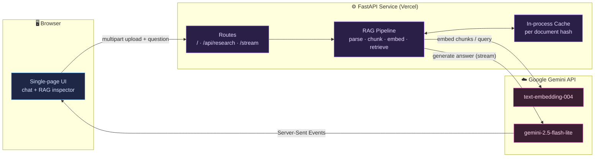
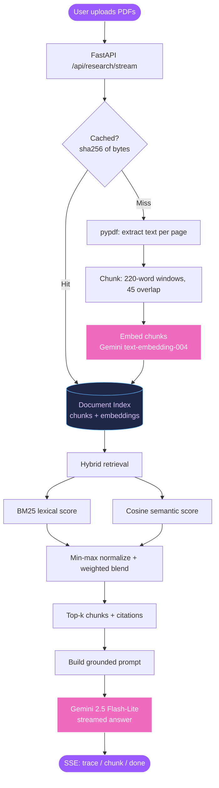
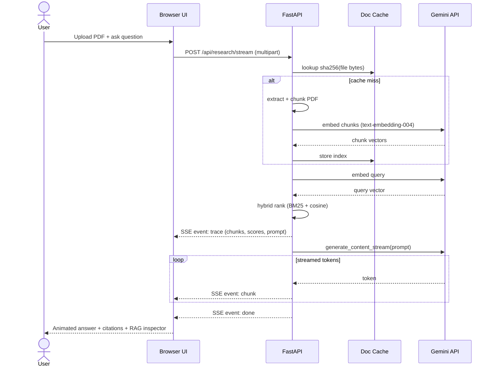
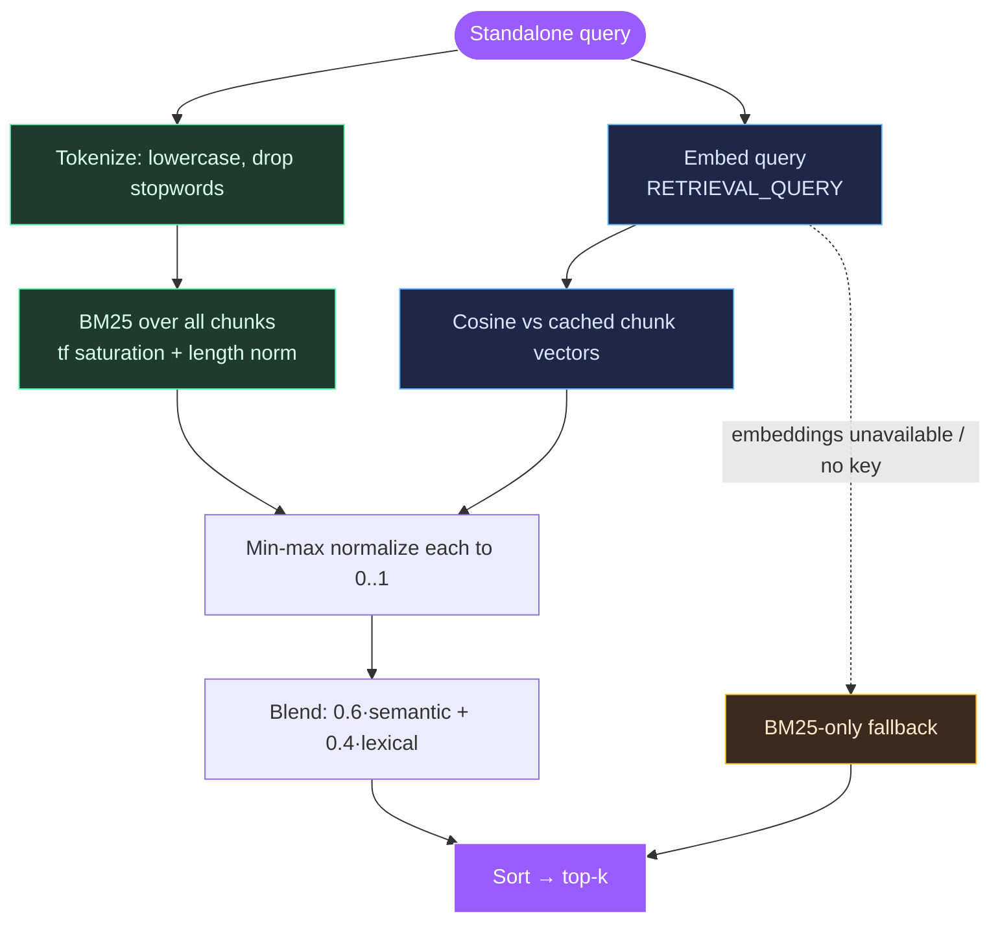

# 🧠 AI RAG Research Assistant — System Design

### Visual architecture, data flow, and design decisions behind a source-grounded RAG assistant

-F06ABF)

📦 **App repo:** [AI-RAG-Research-Assistant](https://github.com/Swarali603/AI-RAG-Research-Assistant) · 📝 **Case study:** [AI-RAG-Case-Study](https://github.com/Swarali603/AI-RAG-Case-Study)

---

## 📌 What this repo is

This is the **design companion** to the AI RAG Research Assistant. It explains *how* the system is put together — not the code line-by-line, but the architecture, the flow of a request, and the trade-offs behind each decision — using diagrams that render natively on GitHub.

> **One-line summary:** Upload PDFs → the system extracts, chunks, embeds, and retrieves the most relevant passages with **hybrid (semantic + lexical) search** → Gemini generates a **cited, source-grounded answer**, streamed token-by-token.

---

## 🗺️ 1. System Context

How the pieces relate at the highest level. A single FastAPI service owns everything: it serves the UI, runs the RAG pipeline, and talks to the Gemini API.

---

## 🔄 2. RAG Pipeline — Data Flow

The journey of a question, from raw PDF bytes to a cited answer. The **cache check** is the key efficiency win: a document is parsed and embedded **once**, not on every question.

---

## ⏱️ 3. Request Sequence

What happens on the wire for a single question, including the streaming response.

---

## 🎯 4. Hybrid Retrieval — The Core Idea

Pure keyword search misses synonyms ("downsides" vs "limitations"); pure embeddings can drift on exact terms and names. **Hybrid** retrieval blends both and degrades gracefully.

> **Why it never breaks:** if the embedding call fails (bad key, rate limit, offline), the embedder returns `None` and the ranker silently falls back to BM25-only. The app always answers.

---

## 🧩 5. Component Breakdown

| Layer | Responsibility | Key choices |
| --- | --- | --- |
| **UI** (served HTML/JS) | Upload, chat, animated streaming, RAG inspector | Zero build step — backend serves one page; SSE for streaming |
| **API** (FastAPI) | Routing, validation, CORS, upload limits | Configurable origins, per-file size cap, SSE responses |
| **Ingestion** | PDF → text → chunks | `pypdf`, 220-word windows with 45-word overlap |
| **Embedding** | Chunk & query vectors | Gemini `text-embedding-004`, task-typed (doc vs query) |
| **Cache** | Avoid re-work | `sha256(file bytes)` → index; FIFO-bounded |
| **Retrieval** | Rank relevant chunks | Hybrid BM25 + cosine, normalized blend, top-k |
| **Generation** | Grounded, cited answer | `gemini-2.5-flash-lite`, streamed; Research / Bestie tone |

---

## ⚖️ 6. Design Decisions & Trade-offs

| Decision | Why | Trade-off accepted |
| --- | --- | --- |
| **Single self-contained FastAPI app** | Simple to deploy on serverless (Vercel); no separate frontend build | Less separation than a full SPA + API split |
| **Gemini embeddings instead of local `sentence-transformers` + FAISS** | Serverless-friendly: no heavy model download or native FAISS build | Per-document embedding API call (mitigated by caching) |
| **Hybrid retrieval with BM25 fallback** | Best of semantic + lexical; never fully breaks | Slightly more ranking logic to maintain |
| **Per-request multipart upload** | Stateless, no storage layer to manage | Same file re-sent each request (cache softens cost) |
| **Streaming via SSE** | Fast perceived response; user sees tokens immediately | Slightly more client-side parsing logic |

---

## 🚀 7. Tech Stack

`Python 3.12` · `FastAPI` · `Uvicorn` · `Google Gemini (google-genai)` · `pypdf` · custom `BM25` · `pytest` · `GitHub Actions` · `Vercel`

---

*Diagrams are written in [Mermaid](https://mermaid.js.org/) and render natively on GitHub.*

